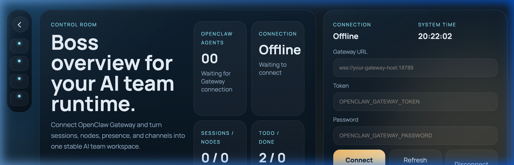
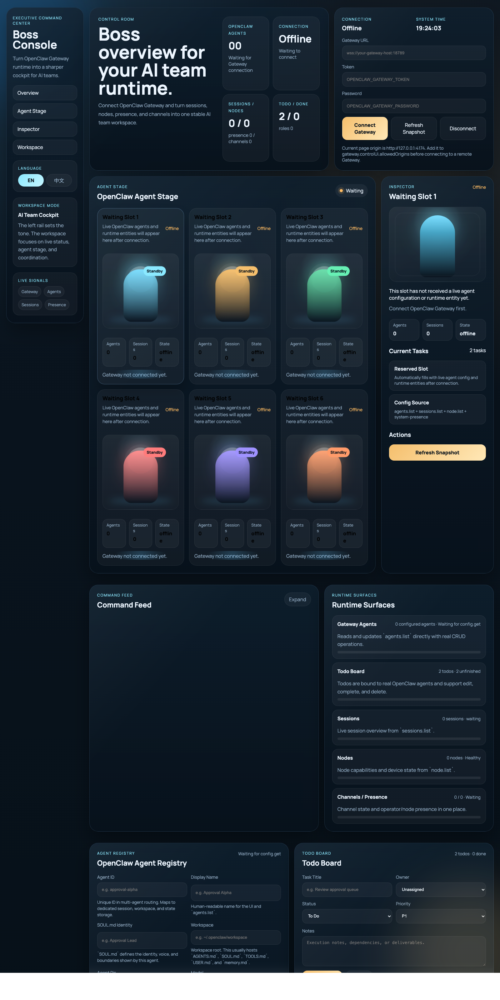

<p align="center">
  
</p>

<h1 align="center">OpenClaw Boss Console</h1>

<p align="center">
  <strong>The visual cockpit your AI team actually wants to use.</strong><br/>
  Connect to OpenClaw Gateway. See agents, sessions, presence, and runtime — in one cinematic workspace.
</p>

<p align="center">
  English | <a href="./README.zh-CN.md">简体中文</a>
</p>

---

## Why Boss Console?

Most AI internal tools look like admin panels. **Boss Console looks like a product.**

It bridges the gap between a raw backend dashboard and a polished team workspace — giving AI teams a single surface to monitor, manage, and present their multi-agent runtime.

| What you get | How it works |
|---|---|
| 🎯 **One-screen command center** | Agents, sessions, presence, and context — all live on one page |
| ⚡ **Real-time Gateway connection** | WebSocket-powered, reflecting Gateway state as it happens |
| 🛠️ **Agent CRUD in the browser** | Create, edit, and delete agents via `config.patch` — no CLI required |
| 🌐 **Bilingual interface** | Full EN / 中文 switch with matching screenshots |
| 🧩 **Zero-framework, zero-build** | Plain HTML + CSS + JS — fork it, hack it, ship it |

---

## Who It's For

<table>
  <tr>
    <td>🏗️ <strong>AI Platform Teams</strong></td>
    <td>Building a workspace layer on top of OpenClaw? Boss Console is a ready-made frontend that speaks your Gateway's protocol.</td>
  </tr>
  <tr>
    <td>🚀 <strong>Founders & Product Leads</strong></td>
    <td>Need to demo your multi-agent product to investors or partners? This is the surface that tells your story.</td>
  </tr>
  <tr>
    <td>👩‍💻 <strong>Developers</strong></td>
    <td>Want a fast, hackable frontend without React/Vue/build-chain overhead? Clone and customize in minutes.</td>
  </tr>
</table>

---

## How It Works

```
┌──────────────────────────────────────────────────────┐
│                   Boss Console                       │
│                                                      │
│  ┌──────────┐  ┌──────────┐  ┌───────────────────┐  │
│  │ Agent    │  │ Command  │  │ Agent Registry    │  │
│  │ Stage    │  │ Feed     │  │ (CRUD via patch)  │  │
│  └────┬─────┘  └────┬─────┘  └────────┬──────────┘  │
│       │              │                 │             │
│       └──────────────┼─────────────────┘             │
│                      │                               │
│               ┌──────▼──────┐                        │
│               │  WebSocket  │                        │
│               └──────┬──────┘                        │
│                      │                               │
└──────────────────────┼───────────────────────────────┘
                       │
               ┌───────▼───────┐
               │   OpenClaw    │
               │   Gateway     │
               └───────────────┘
```

After connecting, the console reads `config.get`, `status`, `health`, `system-presence`, `node.list`, `sessions.list`, and `channels.status` — then renders configured agents first, followed by live runtime entities. **It's not a mockup. It's real system state, product-wrapped.**

---

## Quick Start

No install. No build step. Just serve.

```bash
# 1. Clone the repo
git clone https://github.com/YourOrg/Portal.git
cd Portal

# 2. Start a local server
python3 -m http.server 4173

# 3. Open in browser
open http://127.0.0.1:4173
```

Then enter your **Gateway URL**, **Token**, and **Password** to connect.

---

## Tech Stack

| Layer | Choice |
|---|---|
| Markup | Plain HTML |
| Styling | Plain CSS |
| Logic | Plain JavaScript |
| Framework | None |
| Build Step | None |

> **Philosophy**: Zero dependencies means zero lock-in. Fork it, embed it, restyle it — no toolchain ceremony.

---

## Feature Highlights

<p align="center">
  
</p>


### 🎭 Agent Stage
A cinematic grid that visualizes every agent in your Gateway — with status, identity, and live session data at a glance.

### 🔍 Inspector Panel
Click any agent to reveal its full profile: role, tasks, session metrics, and runtime context.

### 📡 Command Feed
A real-time event timeline showing what's happening across your agent cluster.

### 📋 Agent Registry
Full CRUD for Gateway agents — directly from the browser. Create new agents, edit configurations, or remove them via `config.patch` on `agents.list`.

### ✅ Todo Board
Assign tasks to agents, track priorities (P1/P2/P3), and keep your team's execution visible.

---

## Roadmap

- [ ] Session-to-agent mapping improvements for mismatched runtime / configured IDs
- [ ] Rich raw inspector for entity deep-dives
- [ ] Conflict-safe concurrent `config.patch` writes
- [ ] Search, filter, and sort for larger agent lists
- [ ] Gateway-backed todo persistence & multi-operator collaboration

---

## License

This project is proprietary software. All rights reserved.  
See [LICENSE](./LICENSE) for details.

---

<p align="center">
  <sub>Built by <a href="https://github.com/CaspianChan31">Caspian Chen</a> · Made for teams who believe AI tools should look as good as they work.</sub>
</p>
