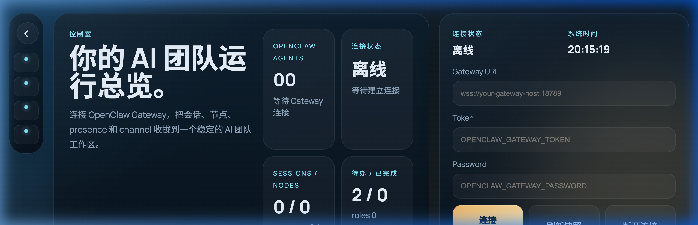
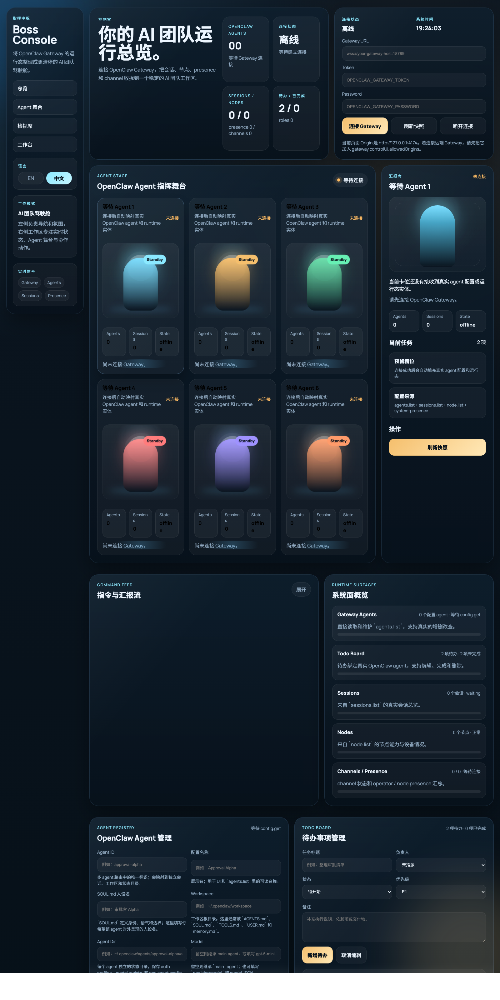

<p align="center">
  
</p>

<h1 align="center">OpenClaw Boss Console</h1>

<p align="center">
  <strong>你的 AI 团队真正想用的视觉化驾驶舱。</strong><br/>
  连接 OpenClaw Gateway，将 agents、sessions、presence 和运行时状态收拢到一个精心设计的工作台中。
</p>

<p align="center">
  <a href="./README.md">English</a> | 简体中文
</p>

---

## 为什么是 Boss Console？

大多数 AI 内部工具看起来像后台管理面板。**Boss Console 看起来像一个产品。**

它填补了原始后端仪表盘与精致团队工作台之间的空白 —— 让 AI 团队在一个界面上就能监控、管理和展示他们的多 Agent 运行时。

| 你能得到什么 | 如何实现 |
|---|---|
| 🎯 **一屏式指挥中心** | Agents、sessions、presence 和上下文 — 全部实时呈现在一个页面 |
| ⚡ **实时 Gateway 连接** | 基于 WebSocket，网关状态变化即时反映 |
| 🛠️ **浏览器内 Agent 增删改查** | 通过 `config.patch` 创建、编辑、删除 Agent — 无需命令行 |
| 🌐 **双语界面** | 完整的中文 / English 切换，配有对应语言截图 |
| 🧩 **零框架、零构建** | 纯 HTML + CSS + JS — 随时 fork、修改、上线 |

---

## 适合谁

<table>
  <tr>
    <td>🏗️ <strong>AI 平台团队</strong></td>
    <td>正在基于 OpenClaw 搭建工作台？Boss Console 是一个开箱即用的前端，直接对接你的 Gateway 协议。</td>
  </tr>
  <tr>
    <td>🚀 <strong>创始人和产品负责人</strong></td>
    <td>需要向投资人或合作伙伴展示你的多 Agent 产品？这就是让故事更有说服力的界面。</td>
  </tr>
  <tr>
    <td>👩‍💻 <strong>开发者</strong></td>
    <td>想要一个轻量、可快速改造的前端，不想碰 React/Vue 和构建工具链？Clone 下来几分钟就能定制。</td>
  </tr>
</table>

---

## 工作原理

```
┌──────────────────────────────────────────────────────┐
│                   Boss Console                       │
│                                                      │
│  ┌──────────┐  ┌──────────┐  ┌───────────────────┐  │
│  │ Agent    │  │ 指令流    │  │ Agent 注册表      │  │
│  │ Stage    │  │ Feed     │  │ (CRUD via patch)  │  │
│  └────┬─────┘  └────┬─────┘  └────────┬──────────┘  │
│       │              │                 │             │
│       └──────────────┼─────────────────┘             │
│                      │                               │
│               ┌──────▼──────┐                        │
│               │  WebSocket  │                        │
│               └──────┬──────┘                        │
│                      │                               │
└──────────────────────┼───────────────────────────────┘
                       │
               ┌───────▼───────┐
               │   OpenClaw    │
               │   Gateway     │
               └───────────────┘
```

连接成功后，控制台读取 `config.get`、`status`、`health`、`system-presence`、`node.list`、`sessions.list` 和 `channels.status` — 优先展示已配置 agents，再补充实时运行时实体。**这不是一层假 UI，而是产品化包装的真实系统状态。**

---

## 快速开始

无需安装。无需构建。直接运行。

```bash
# 1. 克隆仓库
git clone https://github.com/YourOrg/Portal.git
cd Portal

# 2. 启动本地服务器
python3 -m http.server 4173

# 3. 在浏览器中打开
open http://127.0.0.1:4173
```

然后输入你的 **Gateway URL**、**Token** 和 **Password** 即可连接。

---

## 技术栈

| 层级 | 选择 |
|---|---|
| 结构 | 原生 HTML |
| 样式 | 原生 CSS |
| 逻辑 | 原生 JavaScript |
| 框架 | 无 |
| 构建步骤 | 无 |

> **设计理念**：零依赖意味着零绑定。随时 fork、嵌入、重新设计 —— 不需要任何工具链仪式。

---

## 核心功能

<p align="center">
  
</p>


### 🎭 Agent Stage
电影级视觉网格，直观展示 Gateway 中的每一个 Agent — 状态、身份、实时会话数据一目了然。

### 🔍 Inspector 面板
点击任意 Agent 查看完整档案：角色、任务、会话指标和运行时上下文。

### 📡 指令流 (Command Feed)
实时事件时间线，呈现 Agent 集群中正在发生的一切。

### 📋 Agent 注册表
直接在浏览器中对 Gateway Agent 进行完整的增删改查 — 通过 `config.patch` 操作 `agents.list`。

### ✅ Todo Board
为 Agent 分配任务、设定优先级（P1/P2/P3），让团队执行情况一目了然。

---

## 路线图

- [ ] 改进 session 到 agent 的映射（runtime ID 与 configured ID 不一致的场景）
- [ ] 丰富实体原始数据的 Inspector 检视
- [ ] 并发 `config.patch` 写入的安全冲突处理
- [ ] 大规模 Agent 列表的搜索、筛选和排序
- [ ] Gateway 端 todo 持久化与多操作员协作

---

## License

本项目为专有软件，保留所有权利。  
详见 [LICENSE](./LICENSE)。

---

<p align="center">
  <sub>由 <a href="https://github.com/CaspianChan31">Caspian Chen</a> 构建 · 为那些相信 AI 工具应该既好用又好看的团队而作。</sub>
</p>
