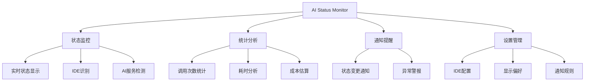
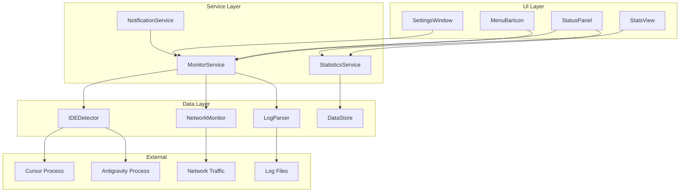
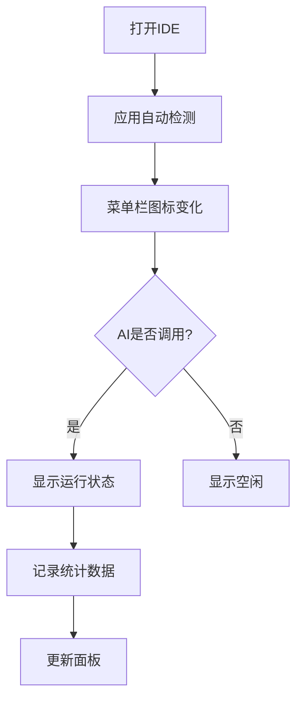

# PRD：AI Status Monitor - macOS菜单栏AI状态监控应用

**版本**: 1.0  
**撰写日期**: 2026-01-10  
**撰写人**: 资深产品经理  
**文档状态**: 草稿

---

## 一、产品背景与目标

### 1.1 产品背景

随着AI辅助编程工具的快速普及，开发者日常工作中会频繁使用多款集成AI功能的IDE，如Cursor、Antigravity等。这些工具在后台调用AI服务时，开发者往往无法直观了解：

- **AI服务是否正在运行**：不清楚当前AI是否在处理请求
- **资源消耗情况**：不知道AI调用对系统资源的占用
- **调用次数和频率**：缺乏对AI调用的统计和管理
- **服务健康状态**：无法及时发现AI服务异常或延迟

这导致开发者在使用AI工具时存在"黑盒"体验，影响工作效率和成本控制。

### 1.2 产品定位

**AI Status Monitor** 是一款轻量级的macOS菜单栏应用，专注于为开发者提供**实时、直观、统一**的AI服务状态监控能力。

### 1.3 产品目标

#### 业务目标
- 填补市场空白，成为开发者工具生态的重要补充
- 3个月内获得1000+活跃用户
- 建立与主流IDE厂商的合作关系

#### 用户目标
- 实时了解各IDE的AI运行状态
- 优化AI使用习惯，降低API调用成本
- 提升开发效率和工作体验

---

## 二、用户画像

### 2.1 核心用户

**职业开发者（Primary Persona）**

| 属性 | 描述 |
|------|------|
| 年龄 | 25-40岁 |
| 职业 | 软件工程师、全栈开发者、独立开发者 |
| 技术栈 | Python/JavaScript/Go等，使用AI辅助编程工具 |
| 工作场景 | 每天使用Cursor、Antigravity等IDE进行开发 |
| 痛点 | 不清楚AI何时在运行，担心额外费用，需要在多个IDE间切换 |
| 期望 | 统一监控所有AI工具，优化使用成本，提高效率 |

### 2.2 次要用户

- **技术团队负责人**：需要监控团队AI使用情况和成本
- **AI产品研究者**：需要了解不同AI工具的性能表现
- **效率工具爱好者**：追求极致的工作流优化

---

## 三、功能需求

### 3.1 功能架构



### 3.2 核心功能详述

#### P0 - 必须实现（MVP）

##### 3.2.1 菜单栏状态显示

**需求描述**  
在macOS菜单栏显示一个紧凑的图标，实时反映AI运行状态。

**功能要点**
- **图标设计**：
  - 空闲状态：灰色静态图标 ●
  - AI运行中：蓝色脉动动画图标 ◉
  - AI异常：橙色警告图标 ⚠
  - 多个AI同时运行：显示数字badge（如 ●²）

- **点击交互**：
  - 点击图标打开下拉面板
  - 显示各IDE的详细状态

**技术要求**
- 图标尺寸：22x22pt（支持Retina）
- 刷新频率：500ms
- 支持深色/浅色模式自适应

##### 3.2.2 IDE监控

**支持的IDE（首批）**

| IDE | 监控方式 | 优先级 |
|-----|----------|--------|
| Cursor | 进程监控 + 网络流量分析 | P0 |
| Antigravity | 日志文件解析 + API调用监听 | P0 |
| VS Code with Copilot | 扩展API调用 | P1 |
| JetBrains with AI Assistant | 进程监控 | P1 |

**监控数据**
- IDE是否运行
- AI服务是否激活
- 当前请求状态（idle/processing/error）
- 最后一次AI调用时间

##### 3.2.3 状态面板

**面板布局**

```
┌─────────────────────────────────┐
│ AI Status Monitor          [⚙️] │
├─────────────────────────────────┤
│ Cursor                    ◉ 运行中│
│ └ Anthropic Claude API           │
│   └ 请求中： 代码补全              │
│   └ 响应时间： 1.2s               │
├─────────────────────────────────┤
│ Antigravity               ● 空闲 │
│ └ Google Gemini API              │
│   └ 最后调用： 5分钟前             │
├─────────────────────────────────┤
│ 今日统计                          │
│ • 总调用次数： 127次               │
│ • 总耗时： 3分18秒                │
│ • 预估成本： $0.45                │
└─────────────────────────────────┘
```

**交互功能**
- 展开/折叠各IDE详情
- 点击IDE名称打开对应应用
- 右上角设置按钮进入配置页面

#### P1 - 重要功能（第二版本）

##### 3.2.4 统计与分析

**数据维度**
- 时间维度：小时、日、周、月
- IDE维度：按IDE分类统计
- 成本维度：基于API定价估算费用

**展示形式**
- 柱状图：每日调用次数趋势
- 饼图：不同IDE的使用占比
- 成本曲线：累计费用变化

##### 3.2.5 智能通知

**通知场景**

| 场景 | 触发条件 | 通知方式 |
|------|----------|----------|
| AI长时间运行 | 单次请求超过30秒 | macOS通知 |
| 异常检测 | API返回错误 | 图标显示+通知 |
| 成本预警 | 当日费用超过设定阈值 | 弹窗提醒 |
| 配额提醒 | API调用次数接近限制 | 菜单栏标记 |

**通知设置**
- 可自定义通知阈值
- 支持免打扰时段
- 可选择通知方式（声音/横幅/标记）

#### P2 - 优化功能（后续迭代）

##### 3.2.6 历史记录

- 记录所有AI调用历史
- 支持搜索和筛选
- 导出数据功能（CSV/JSON）

##### 3.2.7 多设备同步

- 通过iCloud同步统计数据
- 跨设备查看使用情况

##### 3.2.8 插件系统

- 开放SDK，允许第三方IDE接入
- 提供配置模板和示例代码

---

## 四、技术架构设计

### 4.1 技术栈选型

#### 主技术栈
- **开发语言**：Swift 5.9+
- **UI框架**：SwiftUI + AppKit（菜单栏交互）
- **数据存储**：Core Data（本地存储） + UserDefaults（配置）
- **网络监控**：Network.framework
- **进程监控**：NSWorkspace + Process

#### 依赖库
- **Charts**：数据可视化（Swift Charts）
- **Sparkle**：自动更新
- **KeychainAccess**：敏感数据存储

### 4.2 系统架构



### 4.3 核心模块设计

#### 4.3.1 IDE检测器（IDEDetector）

**职责**：识别和监控IDE进程

**实现方式**

```swift
// 伪代码示例
class IDEDetector {
    // 支持的IDE配置
    struct IDEConfig {
        let name: String
        let bundleId: String
        let processName: String
        let aiIndicators: [AIIndicator]
    }
    
    // AI运行指标
    enum AIIndicator {
        case networkTraffic(domain: String)
        case logKeyword(String)
        case cpuThreshold(Double)
    }
    
    func detectRunningIDEs() -> [IDE]
    func monitorIDE(_ ide: IDE) async -> IDEStatus
}
```

**检测策略**

| IDE | 检测方法 | AI状态判定 |
|-----|----------|------------|
| Cursor | Bundle ID: `com.cursor.app` | 监听到 `api.anthropic.com` 请求 |
| Antigravity | 进程名: `Antigravity` | 解析日志中的 `gemini` 关键词 |

#### 4.3.2 网络监控器（NetworkMonitor）

**职责**：监控IDE的AI API网络请求

**实现要点**
- 使用 `Network.framework` 监控系统网络活动
- 过滤特定域名（如 `api.anthropic.com`, `generativelanguage.googleapis.com`）
- 记录请求开始/结束时间，计算响应时延

**隐私考虑**
- 仅监控域名级别，不解析请求内容
- 所有数据本地存储，不上传云端

#### 4.3.3 日志解析器（LogParser）

**职责**：解析IDE日志文件获取AI状态

**示例：Antigravity日志路径**
```
~/Library/Application Support/Antigravity/logs/
```

**解析规则**
```
[2026-01-10 10:30:15] AI Request: gemini-2.0-flash-thinking-exp
[2026-01-10 10:30:17] Response received: 2.1s
```

#### 4.3.4 数据存储（DataStore）

**数据模型**

```swift
// AI调用记录
struct AICallRecord {
    let id: UUID
    let ideName: String          // IDE名称
    let aiProvider: String        // AI提供商（Claude/Gemini等）
    let timestamp: Date           // 调用时间
    let duration: TimeInterval    // 耗时
    let status: CallStatus        // 状态（成功/失败）
    let estimatedCost: Decimal?   // 预估成本
}

enum CallStatus {
    case success
    case failed(error: String)
    case timeout
}
```

**存储策略**
- 使用Core Data存储历史记录
- 保留最近30天数据
- 定期清理过期数据

### 4.4 性能要求

| 指标 | 目标值 |
|------|--------|
| 内存占用 | < 50MB |
| CPU占用（空闲） | < 1% |
| CPU占用（监控中） | < 5% |
| 状态刷新延迟 | < 500ms |
| 应用启动时间 | < 2s |

### 4.5 安全与隐私

#### 权限申请
- **网络监控**：需要用户授权（macOS系统设置）
- **文件访问**：需要访问IDE日志文件夹
- **辅助功能**：可选（用于更精准的IDE状态检测）

#### 数据安全
- 所有数据仅本地存储
- 不收集代码内容或敏感信息
- 开源代码，接受社区审计

---

## 五、UI/UX设计

### 5.1 设计原则

1. **极简主义**：菜单栏应用应保持克制，不抢占注意力
2. **即时反馈**：状态变化应立即可见
3. **原生体验**：遵循macOS设计规范
4. **深色模式**：完美适配深色/浅色主题

### 5.2 视觉设计

#### 5.2.1 菜单栏图标

**设计要求**
- SF Symbols风格
- 支持Template Image（自适应菜单栏颜色）
- 动画流畅（使用CAAnimation）

**状态图标**

| 状态 | 图标 | 颜色 | 动画 |
|------|------|------|------|
| 无AI运行 | circle.fill | 系统灰色 | 无 |
| AI运行中 | circle.hexagongrid.fill | 系统蓝色 | 缩放脉动（1s循环） |
| AI异常 | exclamationmark.triangle.fill | 系统橙色 | 无 |
| 多个AI | circle.fill + badge | 系统蓝色 | 脉动 |

#### 5.2.2 状态面板

**尺寸**：宽度320pt，高度动态（最小200pt，最大600pt）

**组件规范**

```
• 标题栏高度：40pt
• 列表项高度：60pt（折叠），120pt（展开）
• 内边距：16pt
• 圆角：12pt
• 分隔线：0.5pt，系统分隔线颜色
```

**交互状态**
- Hover：背景色变化（alpha 0.05）
- Active：背景色变化（alpha 0.1）
- 展开动画：300ms缓动

#### 5.2.3 设置窗口

**布局**：侧边栏 + 内容区（类似系统偏好设置）

**侧边栏菜单**
1. 通用
2. IDE配置
3. 通知
4. 统计
5. 高级

**设计原则**
- 使用系统标准控件（Toggle、Slider、Picker）
- 每个设置项提供简短说明
- 危险操作（如清除数据）使用确认对话框

### 5.3 用户流程

#### 首次启动流程


**欢迎页面内容**
1. 应用介绍
2. 核心功能说明
3. 隐私承诺

**权限引导**
- 网络监控权限
- 文件访问权限
- 每个权限说明用途

#### 日常使用流程



---

## 六、数据统计与指标

### 6.1 产品指标

#### 使用指标
- **DAU/MAU**：日活/月活用户数
- **留存率**：次日、7日、30日留存
- **使用时长**：应用运行时长
- **监控IDE数量**：平均每用户监控的IDE数量

#### 功能指标
- **面板打开率**：菜单栏点击次数 / 应用启动次数
- **设置配置率**：修改过设置的用户占比
- **通知响应率**：收到通知后的操作率

#### 性能指标
- **检测准确率**：正确识别AI运行状态的比例
- **响应延迟**：从AI启动到状态显示的时间
- **崩溃率**：< 0.1%

### 6.2 数据收集方案

**遵循隐私原则**
- 所有数据收集需用户明确同意
- 仅收集匿名化数据
- 提供完全禁用遥测的选项

**收集内容**（可选开启）
- 应用版本、macOS版本
- 监控的IDE类型（不包含IDE内容）
- 功能使用频次
- 崩溃日志（本地生成，用户主动上传）

---

## 七、实施计划

### 7.1 开发排期

#### Phase 1：MVP（6周）

| 周次 | 任务 | 交付物 |
|------|------|--------|
| W1-W2 | 技术调研与架构设计 | 技术方案文档、原型Demo |
| W3-W4 | 核心功能开发 | 菜单栏显示、IDE检测、状态面板 |
| W5 | Cursor和Antigravity适配 | 支持2个IDE的完整监控 |
| W6 | 内部测试与修复 | TestFlight版本 |

**里程碑**：发布内部测试版

#### Phase 2：Beta（4周）

| 周次 | 任务 | 交付物 |
|------|------|--------|
| W7-W8 | 统计分析功能 | 数据可视化、历史记录 |
| W9 | 通知系统 | 智能提醒功能 |
| W10 | 公开Beta测试 | 收集用户反馈 |

**里程碑**：发布公开Beta版

#### Phase 3：正式发布（2周）

| 周次 | 任务 | 交付物 |
|------|------|--------|
| W11 | Bug修复与优化 | 稳定版本 |
| W12 | 上线准备 | App Store审核、官网、文档 |

**里程碑**：App Store正式发布

### 7.2 团队配置

| 角色 | 人数 | 职责 |
|------|------|------|
| 产品经理 | 1 | 需求管理、项目协调 |
| iOS开发工程师 | 2 | 核心功能开发 |
| UI/UX设计师 | 1 | 界面设计、交互设计 |
| 测试工程师 | 1 | 功能测试、性能测试 |

### 7.3 技术风险与应对

#### 风险1：IDE API变化

**风险描述**：IDE更新可能改变AI调用机制，导致监控失效

**应对措施**
- 设计可插拔的监控适配层
- 建立IDE版本兼容性测试
- 与IDE厂商建立沟通渠道

#### 风险2：macOS权限限制

**风险描述**：macOS隐私政策可能限制网络监控

**应对措施**
- 提供多种监控方式（网络/日志/进程）
- 明确告知用户权限用途
- 提供降级方案（只监控进程，不监控网络）

#### 风险3：性能影响

**风险描述**：监控可能影响系统性能

**应对措施**
- 采用异步监控机制
- 可配置监控频率
- 定期性能测试和优化

---

## 八、商业模式

### 8.1 定价策略

#### 免费版
- 支持2个IDE
- 基础状态监控
- 保留7天历史数据

#### Pro版（$4.99/月 或 $39.99/年）
- 无限IDE支持
- 完整统计分析
- 无限历史记录
- 优先技术支持
- 未来Pro功能优先体验

### 8.2 推广策略

1. **社区运营**
   - 在Reddit、Hacker News、V2EX发布
   - 开源核心监控引擎，吸引开发者贡献

2. **内容营销**
   - 撰写技术博客（如"深入解析Cursor的AI调用机制"）
   - 制作使用教程视频

3. **合作推广**
   - 与AI工具评测网站合作
   - 寻求IDE厂商的官方推荐

---

## 九、成功标准

### 9.1 MVP验证（3个月）

- [ ] 获得1000+下载量
- [ ] 日活用户 > 200
- [ ] 7日留存率 > 40%
- [ ] App Store评分 > 4.5星
- [ ] 收到至少50条有效用户反馈

### 9.2 产品成熟度（6个月）

- [ ] 月活用户 > 5000
- [ ] Pro版转化率 > 10%
- [ ] 支持5+主流IDE
- [ ] 建立用户社区（Discord/论坛）
- [ ] 获得至少1家IDE厂商的官方认可

---

## 十、附录

### 10.1 竞品分析

| 产品 | 定位 | 优势 | 劣势 |
|------|------|------|------|
| ActivityMonitor | 系统监控 | macOS原生，全面 | 不专注AI，信息过载 |
| Stats | 菜单栏监控 | 界面优雅 | 不支持IDE AI状态 |
| - | - | - | **我们的机会** |

**结论**：市场上尚无专门针对IDE AI状态的监控工具，存在明确的产品空白。

### 10.2 技术参考

#### Cursor AI调用检测
- **方法1**：监控网络请求到 `api.anthropic.com`
- **方法2**：检测进程CPU使用率异常（AI推理时CPU会升高）

#### Antigravity AI调用检测
- **方法1**：解析日志文件 `~/Library/Application Support/Antigravity/logs/`
- **方法2**：监听到Google Gemini API域名的网络请求
- **方法3**：通过进程活动检测（如网络连接、文件I/O）

### 10.3 未来规划

#### v2.0（6-12个月）
- [ ] 支持Windows和Linux
- [ ] 团队协作功能（团队统计仪表板）
- [ ] AI成本优化建议
- [ ] 浏览器扩展（监控Web IDE如GitHub Copilot）

#### v3.0（12-24个月）
- [ ] AI使用模式学习，预测最佳使用时段
- [ ] 与AI服务商API对接，显示真实费用
- [ ] 企业版本，支持统一管理和计费

---

## 十一、问题与决策

### 待决策事项

> [!IMPORTANT]
> 以下问题需要在开发前明确：

1. **监控方式确认**
   - Q：Cursor和Antigravity是否有公开API可用于状态查询？
   - A：需要进行技术调研，如无API则采用进程+网络监控方案

2. **隐私合规**
   - Q：网络监控是否符合macOS App Store审核标准？
   - A：需要咨询法务，并准备详细的隐私说明文档

3. **开源范围**
   - Q：应用是否完全开源？
   - A：建议核心监控引擎开源，Pro版功能闭源

### 技术可行性评估

| 技术点 | 可行性 | 复杂度 | 备注 |
|--------|--------|--------|------|
| 菜单栏应用开发 | ✅ 高 | 低 | Swift + AppKit成熟方案 |
| 进程监控 | ✅ 高 | 低 | NSWorkspace API |
| 网络流量监控 | ⚠️ 中 | 高 | 需要用户授权，受macOS限制 |
| 日志文件解析 | ✅ 高 | 中 | 需要逐个IDE适配 |
| 数据本地存储 | ✅ 高 | 低 | Core Data |

---

## 十二、总结

**AI Status Monitor** 旨在解决开发者在使用AI辅助工具时的"黑盒"痛点，通过轻量级的macOS菜单栏应用，提供实时、直观的AI运行状态监控。

**核心价值**：
1. **透明化**：让AI运行状态清晰可见
2. **成本控制**：帮助开发者优化AI使用，降低费用
3. **效率提升**：统一管理多个IDE的AI服务

**差异化优势**：
- 市场空白，无直接竞品
- 专注垂直场景，功能精准
- 开源友好，社区驱动

**风险可控**：
- 技术方案成熟（Swift + macOS原生API）
- 开发周期短（12周MVP）
- 迭代灵活（可根据用户反馈快速调整）

本PRD为产品的v1.0版本提供了完整的需求定义和实施路径，后续将根据用户反馈和市场变化持续迭代优化。

---

**文档审阅人**：技术团队负责人、设计负责人、开发工程师  
**预计下次更新**：技术调研完成后（预计2周内）
